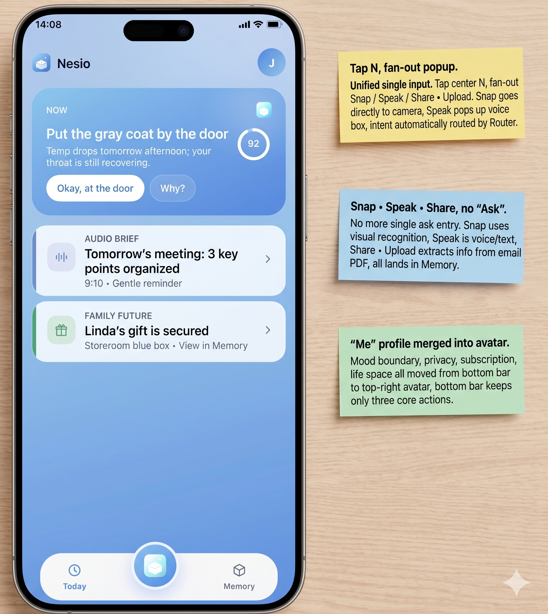

<div align="center">

<sub>◍ &nbsp;N E S I O</sub>

# 少记一点。多生活一点。

### Know Less. Live More.
<sub>Design More. Execute Less.</sub>

<br>

A personal system for people who carry too much in their heads.<br>
It quietly remembers what matters — so you don't have to.

<br>



</div>

<br>

## What is Nesio

Nesio isn't built to help you remember **more**.

It's built so you **don't have to**.

Instead of asking you to organize life into folders, databases, and endless reminders, Nesio quietly captures what matters and hands it back — with its context — the moment you need it.

<br>

## Why

We rarely lose information.

We lose **context**.

> Where did I put my passport?
> Why did I save this document?
> Who was this gift for?
> What happened in yesterday's meeting?
> What was I supposed to do next?

Finding information is easy. Recovering context is hard.

That's what Nesio is built for.

<br>

## Core Experience

**📅 Today**
A calm daily feed. Only the few things that deserve your attention today. No dashboards. No overload.

**◌ Tell Nesio**
Capture life the way it happens — speak a sentence, take a photo, share a link, forward an email. No folders. No tags. No setup. Hand it over, then forget it safely.

**◈ Memory**
Not a file manager — a living record of your life. People, places, objects, documents, promises, moments. Everything stays connected.

**✨ Context Recovery** *(the first milestone)*
Tell it once. Forget safely. When you need it again, Nesio brings back not only the information — but the surrounding context.

<br>

## Design Principles

- **Reduce cognitive load.** The point is a lighter mind, not a fuller one.
- **Capture should be easier than remembering.** If it isn't, people won't.
- **Interrupt less.** Calm is a feature, not an absence.
- **Every suggestion should be understandable.** Show the "why," never a black box.
- **Simplicity is a feature.** What we leave out is the product.

<br>

## The First Life Space — TreasureBox

Big things start from one small, real thing.

Nesio's first Life Space is **TreasureBox** — remembering the physical world: where your things are, when they expire, what you already own. Do that until it's irreplaceable, then grow the rest, one layer at a time.

<br>

## Roadmap

**✅ Available** — Today · Memory · Voice · Photo · File · Connectors · Context Engine

**🚧 In Progress** — Context Recovery · Future Guidance · Life Graph · Personal Intelligence

**🗺️ Planned** — Family Workspace · Shared Memory · Ambient Intelligence · Cross-device

<br>

## Getting Started

```bash
git clone https://github.com/hanbing6228/treasurebox.git
cd treasurebox
npm install
npm run dev
```

<details>
<summary><b>Under the hood</b></summary>

<br>

Local-first by design — your memory lives on your device first, and only leaves it when you choose. Built on Next.js · TypeScript · Tailwind, with Capacitor for iOS. Heavier understanding runs on-device where it can; the cloud is opt-in, never the default.

</details>

<br>

## Vision

The future doesn't need another note-taking app.

It doesn't need another chatbot.

It needs software that quietly helps people live with less mental effort.

Nesio is one step toward that.

<br>

<div align="center">

**Know Less. Live More.**

<sub>Everything belongs to you. Stored on your device first. You decide what leaves it.</sub>

</div>
